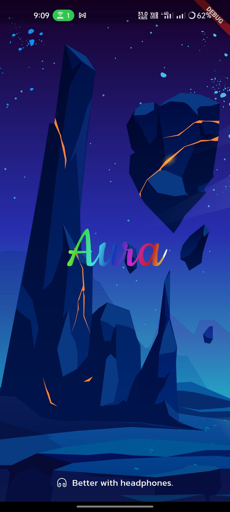
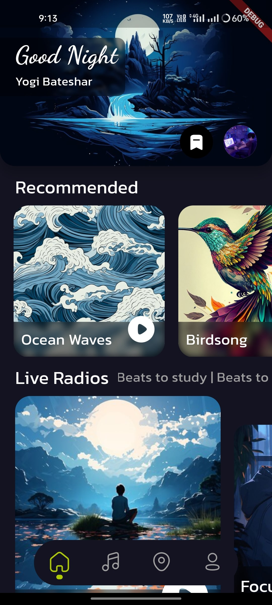
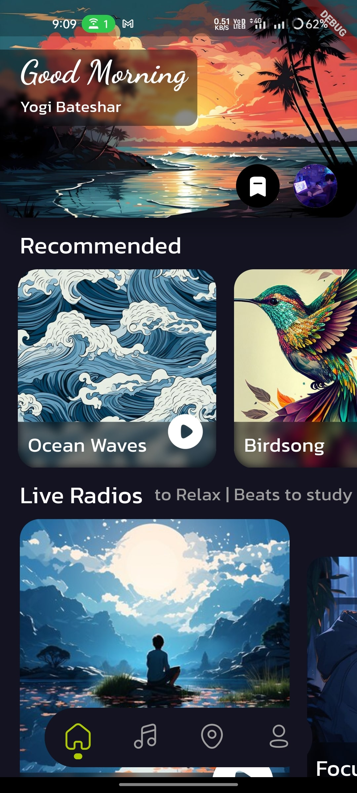
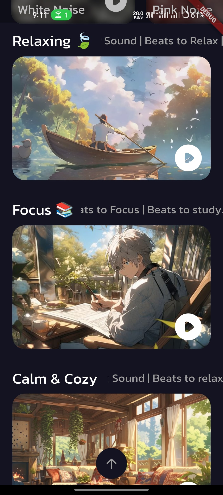
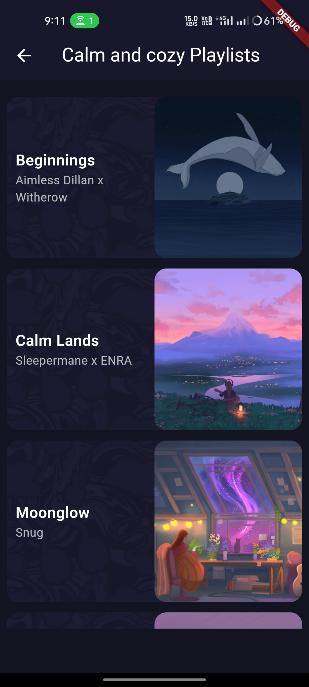
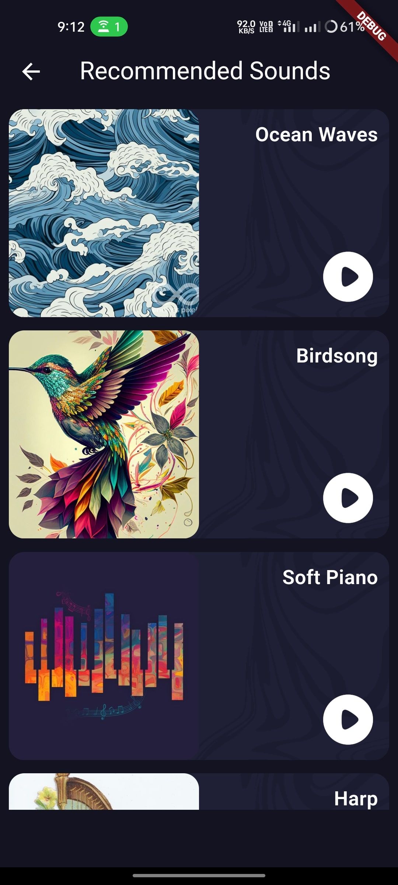
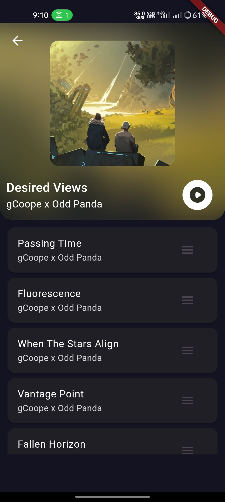
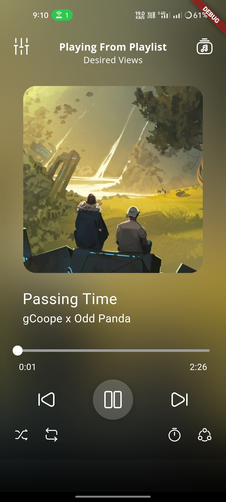
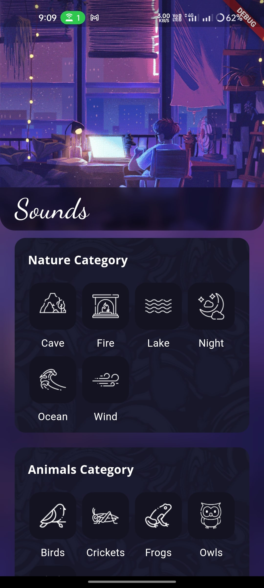
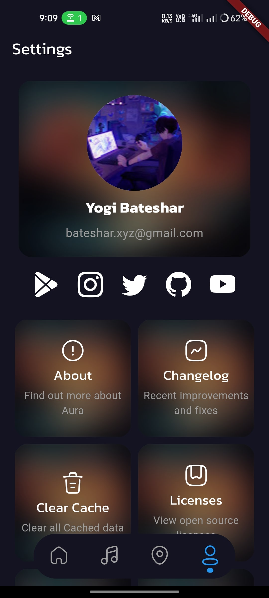

# 
 Aura

Aura is a beautiful Lofi, relaxing, meditation sounds player app for Android. It is built with Dart on top of Google's Flutter Framework.

<b>Aura</b> brings you exclusive Sleep Sounds, Meditation, Lofi Chill Beats, Beats to Study & Beats to relax to your Android device.
With offline listening with composer, helps to relief from a stressful day.

Our main goal is to create an unimaginable self-sustainable experience where people can share relax and enjoy the moment with Aura.

<b>➡Features</b>
- High-Quality Sounds
- Sleep Sounds
- Meditation
- Lofi Chill Beats
- Beats to Study/ Focus
- Beats to relax
- Composer(To create custom relaxing, focus sounds)
  
Feel free to contact us for any issues, yogeshbateshar@gmail.com

## screenshots

**Screens**

|  |  |  |  |  |
|   :-------------: | :-------------:  | :-------------:  | :-------------:  | :-------------:  |
|        Splash     |                 Home           |    Home     |     Explore       |     Playlists     |

|  |  |  |  |  |
|   :-------------: | :-------------:  | :-------------:  | :-------------:  | :-------------:  |
|     Recommended   |  Playlists Sounds  |    Player     |     Composer       |     Settings     |

## Support

Aura app is now available on Google Play, so you can support us by giving a rating to the app.

## Usage

The application files for Android devices can be found on [Google Play Store](https://play.google.com/store/apps/details?id=com.xd.aura).

More information about the releases can be found in the [Release](https://github.com/BatesharXgit/Aura/aura) tab.
